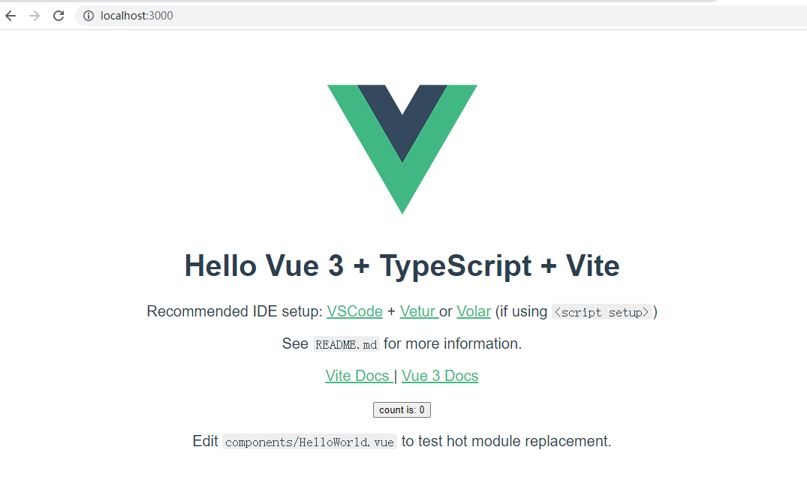
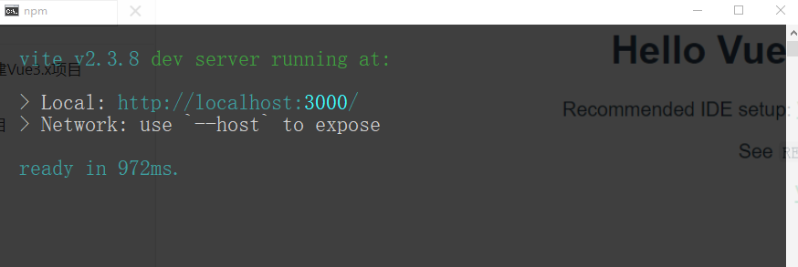
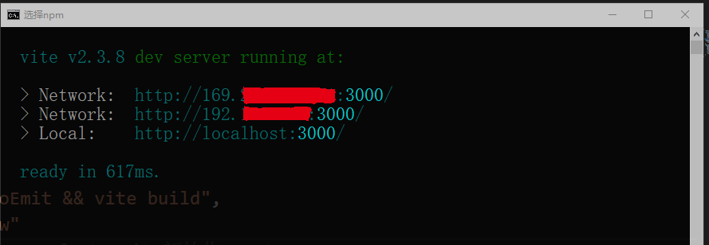

# 从零开始搭建Vue3.x项目

## 前言

个人搭建Vue3.x项目记录。

技术要点：

- Vue3.x
- Vite2.x
- TypeScript4.x
- Vue Router 4.x
- Vuex 4.x
- Axios
- Stylus、Sass、Less

## 开始搭建

### 初始化项目

项目采用 `Vite` 初始化，需要特别注意Vite 需要 [Node.js](https://nodejs.org/en/) 版本 >= 12.0.0。

若版本过低，必须升级Node版本。

```sh
# 查看 node 版本
node -v
# 若 node 版本低于 12.0.0，使用 nvm 安装最新稳定版本node。
nvm install stable
```

 `Vite` 初始化项目架子步骤：

1. 直接采用附加命令的方式直接指定项目名称和模板的方式初始化项目架子。由于我们需要的是vue+ts，所以我们的命令应该是：

```sh
# npm 6.x
npm init @vitejs/app my-vue-app --template vue

# npm 7+, 需要额外的双横线：
npm init @vitejs/app my-vue-app -- --template vue

# yarn
yarn create @vitejs/app my-vue-app --template vue
```

其他初始化方式，详细说明可参考[Vite官网](https://cn.vitejs.dev/guide/#scaffolding-your-first-vite-project)。

2. 安装依赖

```sh
npm install
```

3. 启动项目

```sh
npm run dev
```

在浏览器打开：http://localhost:3000/



启动项目时，在cmd命令行中，我们看见有：



> Network: use `--host` to expose

有时调试，我们也需要使用Network地址，那么我们可以在package.json中的scripts的dev增加参数 `--host` 。

```json
{
  "scripts": {
    "dev": "vite --host"
  }
}
```

然后，重新启动项目



### 设置alias

在vue2.x开发中，我们已经习惯了使用alias，比如

```javascript
import Header from '@/components/Header'
```

在vite.config.ts文件中，我们可以配置

```javascript
import vue from '@vitejs/plugin-vue'
import { resolve } from 'path'
import { defineConfig } from 'vite'

// https://vitejs.dev/config/
export default defineConfig({
  plugins: [vue()],
  resolve: {
    alias: {
      '@': resolve(__dirname, 'src') // 设置 `@` 指向 `src` 目录
    }
  }
})
```

此时发现vscode提示找不到path模块，可以安装 @types/node 解决问题

```sh
npm install @types/node -D
```

### 引入


